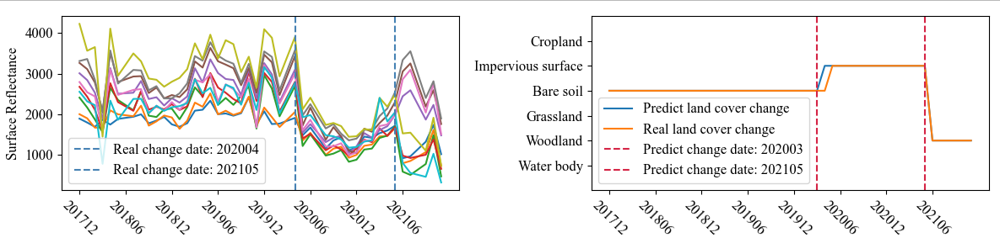

<p align="center">


</p>
<div align="center">
  <!-- <h1><b> Time-LLM </b></h1> -->
  <!-- <h2><b> Time-LLM </b></h2> -->
  <h2><b> Time-series land cover change detection using deep learning-based temporal semantic segmentation </b></h2>
</div>

<div align="center">

**[<a href="https:xxx">Paper Page</a>]**

</div>


### What is TSSCD?

1. We were inspired by the semantic segmentation task of remote sensing images and defined land cover types as semantics. However, we implemented temporal semantic segmentation on a one-dimensional time series. Land cover changes in the representation of remote sensing time series were considered semantic boundaries, and we used existing mature semantic segmentation models to segment different time intervals.
2. To meet the demand for more complex remote sensing time series interpretation and to bridge the **"semantic gap"** between low-level **temporal changes** and high-level **semantic changes**, we build an end-to-end change detection model based on temporal semantic segmentation in the field of computer vision as a prototype design.

### Quick view

You can run demo.py to visualize the output of the TSSCD model. The trained model is saved under the **model_data** folder. Please note that this model parameters is only valid in the research area specified in the paper, and its generalization performance has not been evaluated.

```
python demo.py
```


The input data are all 10m and 20m bands (10 in total) of Sentinel-2, and the time resolution is one month.


### Retrain TSSCD

#### Note:
1. Prepare your training samples and time-phase land cover labels, pay attention to modify the **data_loader.py**. For detailed data format, please refer to the dataset folder.
2. Training data examples can be obtained by accessing the link：https://pan.baidu.com/s/1sjocdnU0XbmPDRedMmwmag?pwd=iv2r 
3. Retrain TSSCD with the following command, and the model with the highest change detection and classification accuracy will be automatically saved.

```
python run.py
```

### Contact

> 🙋 If you have any question or want to use the code, please contact yanjn@cug.edu.cn.

> 🌟 If you find this resource helpful, please consider to star this repository and cite our research.

```
@article{He2024TimeSL,
  title={Time-series land cover change detection using deep learning-based temporal semantic segmentation},
  author={He, Haixu and Yan, Jining and Liang, Dong and Sun, Zhongchang and Li, Jun and Wang, Lizhe},
  journal={Remote Sensing of Environment},
  year={2024}
}
```

### Acknowledgement

We appreciate the following github repos a lot for their valuable code base:

[https://github.com/repository-preservation/lcmap-pyccd](https://github.com/repository-preservation/lcmap-pyccd)

[https://github.com/mortvest/bfast-py/tree/master](https://github.com/mortvest/bfast-py/tree/master)

